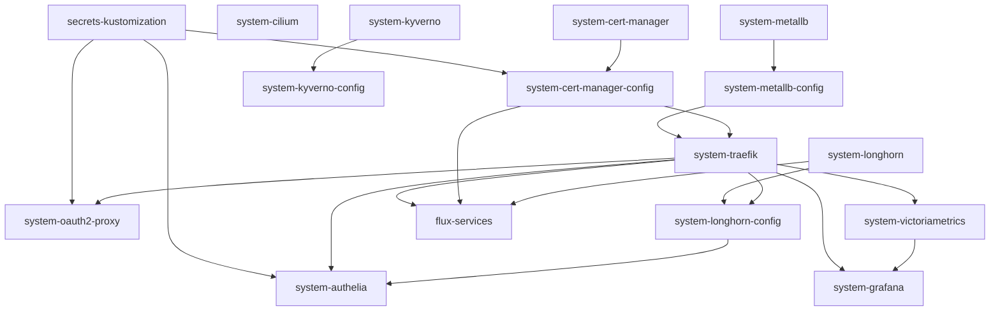

# Cloud-GitOps Architecture Guide

This guide describes the architectural layout, component vs. service distinction, Flux Kustomization hierarchy, and dependency resolution rules for the `cloud-gitops` repository. Any LLM or developer working with this repository must adhere to these patterns.

---

> [!CRITICAL]
> ## Core Rule for LLMs: Pure Declarative GitOps (No Imperative Mutations)
>
> An LLM or automated agent working on this cluster **MUST NOT** use `kubectl` with modify/write access. All changes to cluster state must be made by editing manifests in the Git repository, pushing the commit to Git, and allowing Flux to reconcile the changes.
>
> ### 1. Strict Prohibitions
> - **DO NOT** run imperative mutation commands against the cluster:
>   - `kubectl apply -f ...` (Bypasses GitOps source of truth)
>   - `kubectl delete ...` (Causes immediate disruption and fights Flux reconciliation)
>   - `kubectl edit ...` or `kubectl patch ...` (Introduces silent configuration drift)
>   - `kubectl create ...` (Except when testing harmless local client-side dry-runs)
>   - `kubectl scale ...` (State will be overwritten on the next Flux sync)
>   - `helm install / upgrade / uninstall` (Helm releases must be managed solely via Flux `HelmRelease` manifests)
>
> ### 2. Permitted Actions
> - **Read-Only Diagnostics**:
>   - `kubectl get ...`, `kubectl describe ...`, `kubectl logs ...`, `kubectl top ...`
>   - `kubectl kustomize <path>` (Client-side validation of manifests prior to commit)
> - **Flux Synchronization**:
>   - `flux reconcile source git <source>`
>   - `flux reconcile kustomization <kustomization>`
>   - `flux reconcile helmrelease <release>`
> ### 3. The Standard LLM Change Workflow
> When asked to fix, deploy, modify, or delete any resource in the cluster, follow this exact sequence:
> 1. **Diagnose**: Inspect read-only cluster state (`kubectl get`, `kubectl logs`, etc.).
> 2. **Modify Code**: Edit the appropriate manifest(s) in `cloud-gitops` or `cloud-gitops-secrets`.
> 3. **Validate**: Run client-side validation (`kubectl kustomize <path>`).
> 4. **Commit & Push**: Commit the change with a descriptive message and push to the Git remote.
> 5. **Reconcile**: Trigger Flux reconciliation (`flux reconcile kustomization ...`).
> 6. **Verify**: Use read-only commands to confirm pods/resources reach `Ready` state.
>
> ### 4. Zero Plaintext Secrets or Domains (Kustomization Substitution Only)
> - **DO NOT write out any secrets, credentials, or private domain names in plaintext**:
>   - Never hardcode API keys, PATs, tokens, passwords, private domain names (e.g. `<redacted>`), or personal URLs in manifests, ConfigMaps, or container scripts.
>   - Never hardcode domain or credential fallbacks in application code or scripts (e.g., `os.environ.get("URL", "https://ntfy.<redacted>")` is strictly prohibited; use `os.environ.get("URL", "")` and require injection via environment variables).
> - **Wrap in a Flux Kustomization with `postBuild.substituteFrom`**:
>   - All components and services must be wrapped in a Flux Kustomization CR (`kustomize.toolkit.fluxcd.io/v1`) that includes:
>     ```yaml
>     postBuild:
>       substituteFrom:
>         - kind: Secret
>           name: flux-substitutions
>     ```
>   - In manifests and container specs, use variable placeholders: `${domain}`, `${auth_domain}`, `${admin_email}`, `${github_repo}`, `${<custom_secret>}`.
>   - All actual secret values and domain mappings must reside exclusively in the separate private repository `cloud-gitops-secrets` (`flux-substitutions.yaml`).

---

## 1. Architectural Distinction: Components vs. Services

Everything deployed into the cluster falls strictly into one of two tiers:

| Tier | Purpose | Characteristics | Examples |
|---|---|---|---|
| **Components** | **Foundational Infrastructure** | Parts the cluster cannot function without, or should not function without. Enables base networking, storage, security, policy, and monitoring. | Cilium, MetalLB, Traefik, Cert-Manager, Longhorn, VictoriaMetrics, Grafana, Kyverno, Authelia |
| **Services** | **End-User Value** | Applications and workloads that deliver value to the end user. They rely on the foundational infrastructure provided by components. | Jellyfin, Dispatcharr, Radarr, Sonarr, Skyrim Server, Home Assistant, Ollama, Open-WebUI, Vaultwarden |

---

## 2. Repository Layout & Control Points

```
cloud-gitops/
├── cluster/
│   └── flux-system/
│       ├── gotk-components.yaml      # Flux controller deployments & CRDs
│       ├── gotk-sync.yaml            # Flux GitRepository & root Kustomization
│       ├── secrets-repo.yaml         # Secrets repository source & kustomization
│       ├── flux-components.yaml      # Flux Kustomization CR pointing to ./components
│       ├── flux-services.yaml        # Flux Kustomization CR pointing to ./services
│       └── kustomization.yaml        # Root kustomize: ONLY includes gotk, secrets, flux-components, flux-services
├── components/
│   ├── kustomization.yaml            # SINGLE SOURCE OF TRUTH for what components are enabled
│   ├── hardware/
│   ├── networking/
│   ├── observability/
│   ├── security/
│   └── storage/
└── services/
    ├── kustomization.yaml            # SINGLE SOURCE OF TRUTH for what services are enabled
    ├── ai/
    ├── demo/
    ├── game-servers/
    ├── home-automation/
    ├── management/
    ├── media/
    └── security/
```

### Key Principles:
1. `cluster/flux-system/kustomization.yaml` is clean and high-level. It NEVER contains individual component or service definitions.
2. `components/kustomization.yaml` is solely in charge of which components are enabled.
3. `services/kustomization.yaml` is solely in charge of which services are enabled.

---

## 3. Component Architecture & Config Separation

### Why Config is Separated (`config/` subfolder)
When an operator or HelmRelease is deployed (e.g. MetalLB, Cert-Manager, Kyverno, Longhorn), it introduces Custom Resource Definitions (CRDs) and validating/mutating webhooks.
Applying Custom Resources (e.g. `IPAddressPool`, `ClusterIssuer`, `ClusterPolicy`, `RecurringJob`) in the same manifest batch will fail because:
1. The CRDs are not yet registered with the Kubernetes API server.
2. The admission webhook pods are not yet running and ready to validate the CRs.

### The Self-Contained Component Pattern
Each component that requires post-installation configuration **is in charge of its own config kustomization**:

```
components/<category>/<component>/
├── <component>.yaml                 # HelmRelease, Namespace, etc.
├── cilium-policy.yaml               # Component network policy
├── system-<component>.yaml          # Flux Kustomization CR for the component itself
├── system-<component>-config.yaml   # Flux Kustomization CR for the component config
├── kustomization.yaml               # Includes <component>.yaml, cilium-policy.yaml, and system-<component>-config.yaml
└── config/                          # Subdirectory containing post-install Custom Resources
    ├── kustomization.yaml           # Standard kustomize file listing CR manifests
    └── <custom-resources>.yaml      # IP pools, ClusterIssuers, Policies, Jobs, etc.
```

### How the Config Flow Works:
1. `components/kustomization.yaml` deploys `<category>/<component>/system-<component>.yaml`.
2. Flux reconciles `system-<component>` at `path: ./components/<category>/<component>`.
3. The component's `kustomization.yaml` deploys the component manifests AND the `system-<component>-config` Flux Kustomization CR.
4. `system-<component>-config` specifies:
   - `path: ./components/<category>/<component>/config`
   - `dependsOn: - name: system-<component>`
5. Flux waits until `system-<component>` is healthy and ready, then applies the `config/` resources.

> [!WARNING]
> **Circular Deadlock Prevention (`wait: false` on Parents)**:
> If `system-<component>.yaml` deploys `system-<component>-config.yaml`, the parent `system-<component>.yaml` **MUST set `wait: false`** (or omit `wait: true`).
> If `wait: true` is set on the parent, Flux waits for all applied resources—including `system-<component>-config`—to be Ready before marking the parent Ready. Because the child has `dependsOn: system-<component>`, neither can ever become ready.
> Always configure both Kustomizations with `timeout: 5m0s` and `retryInterval: 1m0s` to prevent transient timeouts during container image pulls and initial webhook setups.

---

## 4. Thorough Dependency Management (`dependsOn`)

Flux Kustomizations (`kustomize.toolkit.fluxcd.io/v1`) must declare explicit dependencies using `spec.dependsOn` to prevent race conditions during cluster bootstrap.

### Standard Dependency Graph:



### Exact Component Dependencies:

1. **`system-metallb-config`**:
   - `dependsOn: [system-metallb]`
2. **`system-cert-manager-config`**:
   - `dependsOn: [system-cert-manager, secrets-kustomization]`
3. **`system-traefik`**:
   - `dependsOn: [system-metallb-config, system-cert-manager-config, system-victoriametrics]`
4. **`system-longhorn-config`**:
   - `dependsOn: [system-longhorn, system-traefik]`
5. **`system-kyverno`**:
   - `dependsOn: [system-victoriametrics]`
6. **`system-kyverno-config`**:
   - `dependsOn: [system-kyverno]`
7. **`system-victoriametrics`**:
   - Reconciles independently (provides foundational Prometheus CRDs required by other components).
8. **`system-grafana`**:
   - `dependsOn: [system-victoriametrics, system-traefik]`
9. **`system-authelia`**:
   - `dependsOn: [system-traefik, system-longhorn-config, secrets-kustomization]`
10. **`system-oauth2-proxy`**:
   - `dependsOn: [system-traefik, secrets-kustomization]`
11. **`flux-services`**:
    - `dependsOn: [flux-components, system-traefik, system-cert-manager-config, system-longhorn]`

---

## 5. Adding a New Component: Step-by-Step

When adding a new component (e.g. `monitoring-agent` in `observability`):

1. **Create Component Directory**:
   `components/observability/monitoring-agent/`
2. **Add Manifests**:
   - `monitoring-agent.yaml` (HelmRelease or Deployment, Namespace)
   - `cilium-policy.yaml` (CiliumNetworkPolicy)
3. **Add Component Flux Kustomization**:
   Create `components/observability/monitoring-agent/system-monitoring-agent.yaml`:
   ```yaml
   apiVersion: kustomize.toolkit.fluxcd.io/v1
   kind: Kustomization
   metadata:
     name: system-monitoring-agent
     namespace: flux-system
   spec:
     interval: 2m0s
     path: ./components/observability/monitoring-agent
     prune: true
     sourceRef:
       kind: GitRepository
       name: flux-system
     dependsOn:
       - name: system-traefik # add whatever infrastructure it requires
     wait: true
     postBuild:
       substituteFrom:
         - kind: Secret
           name: flux-substitutions
   ```
4. **If Post-Install Config is Needed (CRDs/Webhooks)**:
   - Create `components/observability/monitoring-agent/config/`
   - Add CR manifests and `config/kustomization.yaml`
   - Create `system-monitoring-agent-config.yaml` with `dependsOn: [system-monitoring-agent]`
   - Include `system-monitoring-agent-config.yaml` in `components/observability/monitoring-agent/kustomization.yaml`
5. **Register Component in `components/kustomization.yaml`**:
   ```yaml
   resources:
     # ...
     - observability/monitoring-agent/system-monitoring-agent.yaml
   ```

---

## 6. Adding a New Service: Step-by-Step

When adding an end-user service (e.g. `valheim-server` under `game-servers`):

1. **Create Service Directory**:
   `services/game-servers/valheim-server/`
2. **Add Manifests & Kustomization**:
   - `valheim-server.yaml` (Namespace, Deployment/StatefulSet, Service, PVC, etc.)
   - `cilium-policy.yaml` (Strict egress/ingress network policy)
   - `kustomization.yaml` listing the manifests
3. **Register Service in `services/kustomization.yaml`**:
   ```yaml
   resources:
     # ...
     - game-servers/valheim-server
   ```
4. **Do NOT create a separate Flux Kustomization**:
   Services are aggregated and reconciled as a unit under `flux-services`. Only use separate Flux Kustomizations for infrastructure components that other resources depend on.

---

## 7. Protection Against Accidental Deletion / Pruning

To prevent namespaces and persistent volumes from being deleted during Flux garbage collection / pruning or git refactors:

1. **Namespace Manifests**:
   Every `Namespace` definition MUST include the annotation:
   ```yaml
   metadata:
     name: <name>
     annotations:
       kustomize.toolkit.fluxcd.io/prune: disabled
   ```
2. **ClusterPolicy Enforcement**:
   - Kyverno ClusterPolicy `protect-namespaces` automatically mutates all namespaces to ensure `kustomize.toolkit.fluxcd.io/prune: disabled` is present.
   - ClusterPolicy `add-pvc-annotations` ensures both `helm.sh/resource-policy: keep` and `kustomize.toolkit.fluxcd.io/prune: disabled` are added to all PVCs.

